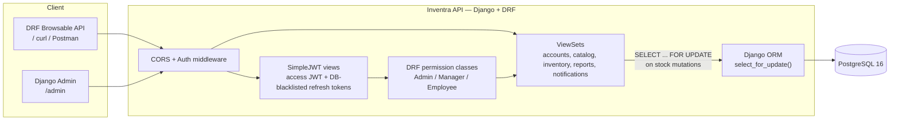

# Inventra (Django port)


Same inventory-management domain as [Inventra](https://github.com/tharunsridhar/Inventra) — products,
suppliers, purchase orders, sales orders, returns, damage write-offs, and an append-only stock ledger,
behind role-based JWT auth — rebuilt on Django 5 + Django REST Framework instead of FastAPI +
SQLAlchemy. Built deliberately as a second implementation of the same spec, so the two can be compared
directly. See [FastAPI vs. Django](#fastapi-vs-django) below for what that comparison actually found.

🔗 **Live demo:** _not deployed yet — see [Deployment](#deployment) for the Railway steps_
📘 **API docs:** DRF's browsable API at any endpoint (e.g. `/products`); `/admin` for the Django Admin

## Architecture



## Tech stack

Django 5 · Django REST Framework · PostgreSQL 16 (psycopg v3) · Django ORM migrations ·
djangorestframework-simplejwt (access JWT + DB-blacklisted refresh tokens) · django-filter ·
whitenoise (static files) · pytest + pytest-django · Docker · GitHub Actions

No frontend in this port — it's API + Admin only, since the frontend isn't part of what's being
compared between the two backends.

## Key engineering decisions

**Immutable transaction ledger, enforced twice.** `InventoryTransactionViewSet` is a
`ReadOnlyModelViewSet` — there's no create/update/delete route registered for it at all, the same
guarantee as Inventra's transactions router only ever defining a `GET`. Django adds a second, independent
enforcement point Inventra doesn't have: `InventoryTransactionAdmin` hard-disables `has_add_permission`,
`has_change_permission`, and `has_delete_permission`, so even a superuser in the Django Admin — the one
interface FastAPI doesn't give you for free — can't edit or delete a ledger row. See
[apps/inventory/admin.py](apps/inventory/admin.py).

**Idempotency guarantees.** Same contract as Inventra: `POST /purchase-orders/{id}/receive` and
`POST /sales-orders/{id}/complete` can be called more than once safely. The first call transitions
`ordered → received` (or `created → completed`) and applies the stock change; every call after that sees
the new status and returns `409 Conflict` with zero side effects.

**Row-level locking.** The idempotency check is only race-free if two concurrent `/receive` calls on the
same order can't both read `status="ordered"` before either commits. Every stock mutation takes
`Model.objects.select_for_update()` on the order row and each affected product row — locked in a fixed
id-sorted order, so transactions touching the same products queue up instead of deadlocking — before
checking state. Same Postgres `READ COMMITTED` + explicit locks strategy as Inventra, just
`select_for_update()` instead of SQLAlchemy's `with_for_update()`. See
[apps/inventory/views.py](apps/inventory/views.py) and
[tests/test_concurrency.py](tests/test_concurrency.py) for two tests that prove it with real concurrent
HTTP requests against a `live_server`.

**Revocable refresh tokens.** `djangorestframework-simplejwt`'s `token_blacklist` app is the DRF-idiomatic
version of Inventra's DB-stored `revoked` boolean: `ROTATE_REFRESH_TOKENS` + `BLACKLIST_AFTER_ROTATION`
record every rotated-out token, and `POST /auth/logout` blacklists the current one, so
`/auth/refresh` rejects it immediately afterward. A library-provided mechanism instead of a hand-rolled
column, same guarantee.

## Quickstart

```bash
cp .env.example .env
docker compose up --build
```

Reaches **http://localhost:8000**:
- `/admin` — Django Admin (create a superuser first, see below)
- any resource path, e.g. `/products` — DRF's browsable API (HTML form + JSON, no separate client needed)
- `/health` — liveness + DB connectivity check

Migrations and `collectstatic` run automatically on container start (see `docker-entrypoint.sh`), before
`gunicorn` boots.

**Creating an admin user** (no seed script — Django ships this for free):

```bash
docker compose exec api python manage.py createsuperuser
```

**Running on the host instead of Docker:**

```bash
uv sync
cp .env.example .env   # point DATABASE_URL at a Postgres you can reach
uv run python manage.py migrate
uv run python manage.py createsuperuser
uv run python manage.py runserver
```

## Running the tests

```bash
uv sync
cp .env.example .env   # DATABASE_URL just needs to point at a reachable Postgres 16
uv run pytest -v
```

pytest-django creates its own `test_<database>` database against that same Postgres server, runs every
migration against it, and drops it when the session ends — no SQLite stand-in, same dev/test/prod parity
principle as Inventra. Most tests use the `db` fixture, which wraps each test in a transaction rolled back
afterward (Django's built-in mechanism). The two concurrency tests opt into `django_db(transaction=True)` +
`live_server` instead, so they get real independent connections and can exercise actual Postgres row
locking. See [tests/conftest.py](tests/conftest.py).

Covers: role-based access control, the atomic/idempotent transaction guarantee (including the immutable
ledger having no write route), and the concurrency proof described above. 15 tests, including 2 real
concurrency tests.

## Deployment

Containerized, deploys to [Railway](https://railway.app) from the Dockerfile directly (see
`railway.json`). Every required environment variable is documented in
[.env.example](.env.example). Short version: create a Railway project from this repo, add a PostgreSQL
addon, set `DATABASE_URL=${{Postgres.DATABASE_URL}}`, `DJANGO_SECRET_KEY`, `ALLOWED_HOSTS`, and
`CORS_ALLOWED_ORIGINS` on the api service, deploy — migrations and `collectstatic` run automatically
before the app starts. `/health` reports both app and database status and backs Railway's own healthcheck.

## Roles & permissions

- **Admin** — full access, including user management, via both the API and the Django Admin.
- **Manager** — products, suppliers, categories, purchases, sales, approves returns, logs damage, views reports/dashboard.
- **Employee** — views products/inventory, creates and completes sales orders only.

## Core business flow

```
Supplier → Purchase Order (ordered) → /receive → Product.current_stock +=
Customer → Sales Order (created)    → /complete → Product.current_stock -=
Sales Order (completed) → Return (pending) → Manager /approve → Product.current_stock +=
Manager/Admin → Damage write-off (reason required) → Product.current_stock -=
```

## API overview

- `auth` — `/auth/register`, `/auth/login`, `/auth/refresh`, `/auth/logout` (blacklists the refresh
  token), `/users/me`
- `users` (Admin only, `/users`) — CRUD via `UserViewSet`
- `categories`, `suppliers`, `products` — CRUD + soft delete; products support search/filter/ordering
  via `django-filter`
- `purchase-orders` — create, update (pre-receive only), `/receive` (locked, idempotent)
- `sales-orders` — create, update (pre-complete only), `/complete` (locked, idempotent), `/invoice`
- `returns` — create (reservation-locked against the parent sales order), `/approve` (Manager/Admin, locked)
- `damage` — write-off (Manager/Admin, reason required, locked)
- `inventory-transactions` — read-only audit trail, filterable by product/type/date range
- `dashboard`, `reports/products`, `reports/purchases`, `reports/sales`, `reports/inventory` — aggregate
  views, date-range filterable
- `notifications` — per-user, filterable by unread, mark-as-read

## Project structure

```
apps/
  accounts/     - custom User (role as a TextChoices field, not a lookup table), JWT auth, permissions.py
  catalog/      - Category, Supplier, Product
  inventory/    - PurchaseOrder(+Item), SalesOrder(+Item), InventoryTransaction ledger, Return
  reports/      - no models - aggregation views only
  notifications/- Notification, per-user create/list/mark-read
config/
  settings/     - base.py / development.py / production.py
  urls.py       - route table, /health
tests/          - pytest-django suite (see "Running the tests" above)
Dockerfile, docker-compose.yml, railway.json - see Quickstart / Deployment
.github/workflows/ci.yml - migrations + pytest + ruff on every push/PR to main
```

Five apps, not eleven — `inventory` groups PurchaseOrder/SalesOrder/Return/InventoryTransaction together
deliberately, since they're all tightly coupled around the one stock ledger, rather than mirroring
Inventra's one-router-per-resource layout one-for-one.

## FastAPI vs. Django

Same domain, same database, same concurrency guarantees, built twice. This is the honest version of that
comparison — not a diplomatic "both are great" writeup, but where each one actually won.

**Development speed.** Django won this decisively for a CRUD-and-workflow domain like this one. The
custom User model, JWT auth, and the admin interface all came from installing an app and writing a few
settings lines, not hand-rolled code — SimpleJWT's `token_blacklist` app replaced what was a full
`RefreshToken` model, revoke logic, and matching Alembic migration in Inventra. `ModelViewSet` +
`DefaultRouter` generates list/create/retrieve/update/delete routing from one class; FastAPI needed a
handwritten function per verb per resource. The tradeoff showed up on the two custom-transaction
endpoints (`/receive`, `/complete`) — DRF's generic-view conventions actively fight you once the logic
stops being "CRUD," and both ended up as manually written `@action` methods with the framework mostly out
of the way, so the win is concentrated in the boilerplate-heavy 80%, not the interesting 20%.

**The Django Admin.** This is the single biggest capability gap between the two stacks, not a minor
convenience. Inventra has no equivalent at all — internal tooling (fixing a bad order, adjusting a
supplier record, looking up a user) means writing an endpoint or reaching for `psql`. Here it's
free, and it's not just free CRUD: `InventoryTransactionAdmin`'s hard-disabled add/change/delete
permissions mean the immutable-ledger guarantee holds in the one interface that bypasses the API layer
too. The cost is real, though — the Admin is a second UI to keep in sync with the domain model (inlines,
`readonly_fields`, `autocomplete_fields` all needed deliberate configuration; left alone, it would happily
expose a "delete transaction" button), and it's a Django-only concept, so it doesn't transfer if the next
job's stack doesn't include Django.

**ORM differences.** Django's ORM is more concise for the common case — `select_for_update()`,
`bulk_create()`, `F()` expressions, and migrations autogenerated from model diffs all require less code
than SQLAlchemy 2.0's explicit `Session`/`select()`/Alembic-revision workflow. SQLAlchemy wins on
explicitness once queries get complex: Alembic revisions are readable diffs you write and review, while
`makemigrations` output requires trusting Django's diff detection (and occasionally correcting it by
hand for renames or data migrations). For this project's `SELECT ... FOR UPDATE` locking pattern, both
express it in one line (`.select_for_update()` vs `.with_for_update()`) — no real difference at the point
that mattered most.

**Async support.** FastAPI's is the more honest story for a fully async I/O path — PhotoShare (the other
port in this series) runs async SQLAlchemy, async Redis, and Celery end to end with no sync boundary
anywhere. Django 5 supports async views and an async ORM interface, but this project's `select_for_update()`
locking pattern and DRF itself are still fundamentally sync underneath, so going async here would mean
either accepting a sync/async boundary mid-request or dropping DRF for something like Django Ninja — not
a natural fit for what this specific service needs (transactional writes, not high-concurrency I/O), but
a genuine limitation for services that do need it.

**Ecosystem maturity.** Django's is broader and older — Admin, auth, the ORM, migrations, and forms all
ship in one coherent package with a couple decades of production hardening and a huge base of vetted
third-party apps (`django-filter`, `whitenoise`, `simplejwt` here). FastAPI's ecosystem is newer and more
assembled-by-hand — every one of those pieces (auth, admin-equivalent, migrations) is a separate choice
you make and wire together yourself, pydantic-settings and Alembic being the closest analogues. That's
more decisions to get right, but also less framework opinion to work around when a project's shape
doesn't match Django's assumptions.

**When I'd choose which.** Django for an admin-heavy, CRUD-and-workflow-dominant internal tool where
"someone needs to fix a bad record without me shipping a new endpoint" is a real, recurring need — this
project is exactly that shape, which is why Django came out ahead here. FastAPI for an async-native,
latency-sensitive, or API-only service with no internal-tooling surface — PhotoShare's Celery-backed image
pipeline is exactly that shape, which is why it stayed on FastAPI rather than getting a third port.

## Deferred to v2+

Multi-warehouse support, partial PO receiving, PO approval workflow, supplier returns, PDF
invoices/reports, email-based password reset/notifications, rate limiting, structured logging, Redis
caching, background jobs, file storage — same list as Inventra, since it's the same spec.
