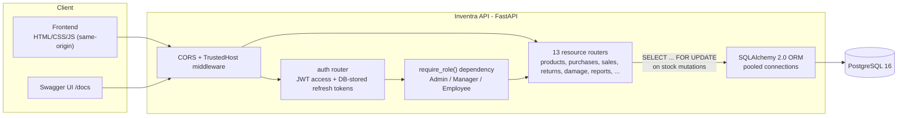

# Inventra


Inventory management backend for a single-warehouse, single-currency retailer: products, suppliers, purchase orders, sales orders, returns, damage write-offs, and a stock movement ledger that's never edited or deleted, behind role-based JWT auth.

🔗 **Live demo:** _not deployed yet, see [Deployment](#deployment) for the Railway steps, then replace this line with the live URL_
📘 **API docs:** `<your-domain>/docs` (Swagger UI, generated from the code below)

## Architecture



## Tech stack

- FastAPI, SQLAlchemy 2.0 (psycopg v3), PostgreSQL 16, Alembic
- pydantic-settings
- JWT (access + DB-stored revocable refresh tokens), bcrypt
- pytest + pytest-asyncio + httpx
- Docker, GitHub Actions
- Frontend: plain HTML/CSS/JS, no build step, no framework, served directly by FastAPI, same origin as the API

## Key engineering decisions

**Immutable transaction ledger.**
- Every stock-affecting action (purchase received, sale completed, return approved, damage written off) appends exactly one `InventoryTransaction` row. There is no `PATCH`/`DELETE` route on that resource at all.
- The audit trail can't be edited or erased after the fact, and that guarantee is structural (it's about which routes exist), not something application logic could accidentally bypass.

**Idempotency guarantees.**
- Receiving a purchase order or completing a sales order can be called more than once safely.
- The first call transitions `ordered -> received` (or `created -> completed`) and applies the stock change.
- Every call after that sees the new status and returns `409 Conflict` with zero side effects. That matters for retried requests and double-clicks, not just malicious replay.

**Row-level locking.**
- The idempotency check above is only safe if it's race free. Two concurrent `/receive` calls on the same order could otherwise both read `status="ordered"` before either commits, and both apply the stock change.
- Every stock mutation takes a `SELECT ... FOR UPDATE` lock on the order row (and each affected product row, locked in a fixed id-sorted order to avoid deadlocking transactions that touch the same products) before checking state, so the second request blocks until the first commits and then correctly sees the new status.
- Plain Postgres `READ COMMITTED` plus explicit locks, deliberately not `SERIALIZABLE`. No retry-on-serialization-failure loop needed. See [tests/test_concurrency.py](tests/test_concurrency.py) for a test that proves it.

**Revocable refresh tokens.**
- Refresh tokens are opaque random strings stored in a DB table, not a second JWT.
- A pure-JWT refresh token can't be invalidated before its own expiry without maintaining a blocklist.
- A DB-backed token means `/auth/logout` (or an admin disabling a user) is one `UPDATE ... SET revoked = true` and the token stops working everywhere, immediately.

## Quickstart

```bash
cp .env.example .env
docker compose up --build
```

Reaches **http://localhost:8000**:
- `/`: the frontend (login screen and app)
- `/docs`: interactive Swagger UI
- `/health`: liveness + DB connectivity check

Migrations run automatically on container start (see `docker-entrypoint.sh`), before `uvicorn` boots.

**Demo credentials** (seed with `docker compose exec api uv run python seed.py`, or `uv run python seed.py` if running on the host):

| Role     | Email                    | Password     |
|----------|---------------------------|---------------|
| Admin    | admin@inventra.com        | admin123      |
| Manager  | manager@inventra.com      | manager123    |
| Employee | employee@inventra.com     | employee123   |

**Running on the host instead of Docker:**

```bash
uv sync
cp .env.example .env   # point DATABASE_URL at a Postgres you can reach
uv run alembic upgrade head
uv run python seed.py
uv run uvicorn app.main:app --reload
```

## Running the tests

```bash
uv sync
cp .env.example .env   # DATABASE_URL just needs to point at a reachable Postgres 16
uv run pytest -v
```

- The suite creates its own `<database>_test` database against that same Postgres server, runs every Alembic migration against it, and drops it when the session ends. No SQLite stand-in, since the whole point of the Postgres migration was dev/test/prod parity.
- Each test runs inside a transaction that's rolled back afterward (SQLAlchemy's `join_transaction_mode="create_savepoint"`), except the concurrency tests, which deliberately use real independent connections to exercise actual Postgres row locking. See [tests/conftest.py](tests/conftest.py).

Covers auth lifecycle including refresh token revocation, role-based access control, the atomic/idempotent transaction guarantee, and the concurrency proof described above.

## Deployment

- Containerized, deploys to [Railway](https://railway.app) from the Dockerfile directly (see `railway.json`).
- Every required environment variable is documented in [.env.example](.env.example).
- Short version: create a Railway project from this repo, add a PostgreSQL addon, set `DATABASE_URL=${{Postgres.DATABASE_URL}}` plus `JWT_SECRET` on the api service, deploy. Migrations run automatically before the app starts.
- `/health` reports both app and database status and backs Railway's own healthcheck.

## Roles & permissions

- **Admin**: full access, including user management.
- **Manager**: products, suppliers, categories, purchases, sales, approves returns, logs damage, views reports/dashboard.
- **Employee**: views products/inventory, creates and completes sales orders only.

## Core business flow

```
Supplier → Purchase Order (ordered) → /receive → Product.current_stock +=
Customer → Sales Order (created)    → /complete → Product.current_stock -=
Sales Order (completed) → Return (pending) → Manager /approve → Product.current_stock +=
Manager/Admin → Damage write-off (reason required) → Product.current_stock -=
```

## API overview

See `/docs` for the full interactive schema.

- `auth`: register, login, refresh, logout (revokes the refresh token), me
- `users` (Admin only): CRUD, assign-role, reset-password, enable/disable
- `categories`, `suppliers`, `products`: CRUD + soft delete, search/filter/sort/pagination on products
- `purchase-orders`: create, update (pre-receive only), receive (locked, idempotent)
- `sales-orders`: create, update (pre-complete only), complete (locked, idempotent), invoice
- `returns`: create (reservation-locked against the parent sales order), approve (Manager/Admin, locked)
- `damage`: write-off (Manager/Admin, reason required, locked)
- `inventory-transactions`: read-only audit trail, filterable by product/type/date range
- `dashboard`: aggregate counts and low/out-of-stock indicators
- `reports`: products / purchases / sales / inventory, JSON, date-range filterable
- `notifications`: per-user, filterable by unread, mark-as-read

## Project structure

```
app/
  main.py       - creates the FastAPI app, middleware, /health, serves the frontend
  config.py     - pydantic-settings; every value documented in .env.example
  database.py   - SQLAlchemy engine (pooled) + session + get_db()
  models.py     - every SQLAlchemy table
  schemas.py    - every Pydantic request/response model
  auth.py       - password hashing, JWT, get_current_user / require_role
  utils.py      - datetime + notification helpers
  routers/      - one file per resource (auth, users, products, sales, ...)
alembic/        - migrations (single clean initial revision against Postgres)
frontend/       - index.html + styles.css + app.js
tests/          - pytest suite (see "Running the tests" above)
seed.py         - demo data
Dockerfile, docker-compose.yml, railway.json - see Quickstart / Deployment
.github/workflows/ci.yml - migrations + pytest + ruff on every push/PR to main
```

No repository/service layers. Each router talks to the database directly with plain SQLAlchemy queries.

## Design notes / deliberate defaults

A few points were left implicit in the original spec and resolved as follows:

- Sales lifecycle is two-step, symmetric with purchase orders: `POST /sales-orders` creates a `created` order (no stock check yet); `PATCH /sales-orders/{id}/complete` validates stock, deducts it, writes the transaction, and generates the invoice, all in one atomic, idempotent, row-locked transaction.
- `POST /auth/register` always creates an Employee account; only an Admin can promote a user via `PATCH /users/{id}/role`.
- There is no separate `invoices` table (not in the spec's finalized table list). The completed sales order itself carries `invoice_number` / `invoiced_at`.
- Damage write-offs reuse `inventory_transactions.reason` (nullable, populated only for damage rows) rather than a dedicated damage table, for the same reason.
- A return reserves its quantity against the sold amount as soon as it's filed (not only once approved), so two pending returns can't later both be approved and jointly exceed what was actually sold, enforced by locking the parent sales order for the duration of the reservation check.

## Deferred to v2+

Multi-warehouse support, partial PO receiving, PO approval workflow, supplier returns, PDF invoices/reports, email-based password reset/notifications, refresh token rotation, extensible RBAC, rate limiting, structured logging, Redis caching, background jobs, file storage.
