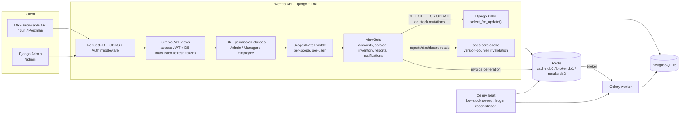

# Inventra (Django port)


**Locked: 78 sales against 100 units of stock, stock dropped by exactly 78. Unlocked, same test: 66 sales recorded but stock only dropped by 50, 16 silently lost, zero HTTP errors either way.**

That's the headline from Phase 6's load test, not a claim. Concurrent requests hitting the same product without row-level locking don't fail loudly, they corrupt the ledger silently: the response looks like a success, the invoice gets issued, and the stock count just quietly stops matching the sales it recorded. Full numbers, the mechanism, and how to reproduce it: [Performance](#performance) below, full writeup in [docs/v2/LOAD_TEST_RESULTS.md](docs/v2/LOAD_TEST_RESULTS.md).

*(No GIF embedded here: one was captured live against a running Locust dashboard during this work, but the exported file's location couldn't be resolved in the sandboxed environment this was built in. `loadtest/README.md` reproduces the same run on demand, screen-recordable in any normal terminal.)*

Same inventory management domain as [Inventra (FastAPI)](https://github.com/tharunsridhar/Inventra/tree/fastapi), rebuilt on Django 5 + Django REST Framework. This branch (`v2`) adds caching, background jobs, rate limiting, structured logging, and the load-test evidence above on top of the working v1 domain port. See [FastAPI vs. Django](#fastapi-vs-django) for the original stack comparison.

- Products, suppliers, purchase orders, sales orders, returns, damage write offs
- Append only stock ledger, enforced twice (no write route, and the Admin can't edit or delete it either)
- Role based JWT auth, rate limited per scope
- Redis-cached reports, Celery background jobs (async invoices, low-stock alerts, nightly ledger reconciliation)
- Structured JSON logging with one request id traced across the web process and any worker task it dispatches

📘 **API docs:** DRF's browsable API at any endpoint (e.g. `/products`), `/admin` for the Django Admin

## Performance

Measured on a single local dev machine (not production hardware, see [docs/v2/LOAD_TEST_RESULTS.md](docs/v2/LOAD_TEST_RESULTS.md) for the exact specs and every caveat), 40 concurrent users hitting `/sales-orders/{id}/complete` against one product with 100 units of stock:

| Locking | Sold | Stock actually dropped by | Discrepancy | HTTP errors |
|---|---|---|---|---|
| OFF | 66 | 50 | **16 lost updates** | 0 |
| ON | 78 | 78 | **0** | 0 |

Both rows show zero HTTP errors. That's the point: the unlocked path doesn't fail, it silently loses updates under READ COMMITTED, since two concurrent transactions can both read the same pre-decrement stock value before either commits. `select_for_update()` closes that window by making the second transaction's read wait for the first to commit, then re-read the already-updated value.

- Full results, the analysis, and how to reproduce both rows on demand: [docs/v2/LOAD_TEST_RESULTS.md](docs/v2/LOAD_TEST_RESULTS.md)
- Locking tradeoff writeup: [docs/v2/adr/0003-locking-tradeoff.md](docs/v2/adr/0003-locking-tradeoff.md)
- Cache effectiveness (Phase 2, proven via query counts, not just timing): report/dashboard endpoints go from 9/2/3 queries to 1 on a cache hit, verified directly with `CaptureQueriesContext` in `tests/test_caching.py`

## Architecture



## Tech stack

- Django 5, Django REST Framework
- PostgreSQL 16 (psycopg v3), Django ORM migrations
- djangorestframework-simplejwt (access JWT + DB blacklisted refresh tokens)
- django-filter
- Redis, django-redis (cache), Celery (background jobs, periodic schedule via `CELERY_BEAT_SCHEDULE`, no separate scheduler package)
- structlog (structured JSON logging in production, colored console in dev)
- reportlab (invoice PDF generation)
- locust (load testing, dev dependency only)
- whitenoise for static files
- pytest + pytest-django
- Docker, GitHub Actions

No frontend in this port. It's API + Admin only, since the frontend isn't part of what's being compared between the two backends.

## Key engineering decisions

**Immutable transaction ledger, enforced twice.**
- `InventoryTransactionViewSet` is a `ReadOnlyModelViewSet`. There's no create/update/delete route registered for it at all, the same guarantee as Inventra's transactions router only ever defining a `GET`.
- Django adds a second, independent enforcement point Inventra doesn't have: `InventoryTransactionAdmin` hard disables `has_add_permission`, `has_change_permission`, and `has_delete_permission`, so even a superuser in the Django Admin can't edit or delete a ledger row. See [apps/inventory/admin.py](apps/inventory/admin.py).

**Idempotency guarantees.**
- `POST /purchase-orders/{id}/receive` and `POST /sales-orders/{id}/complete` can be called more than once safely.
- The first call transitions `ordered -> received` (or `created -> completed`) and applies the stock change.
- Every call after that sees the new status and returns `409 Conflict` with zero side effects, logged as `idempotent_replay_409` (see [Structured logging](#structured-logging)).

**Row level locking, with the cost measured, not assumed.**
- The idempotency check is only race free if two concurrent `/receive` calls on the same order can't both read `status="ordered"` before either commits.
- Every stock mutation takes `select_for_update()` on the order row and each affected product row, locked in a fixed id sorted order, so transactions touching the same products queue up instead of deadlocking.
- See [Performance](#performance) above for what removing this actually does under real concurrent load, and [apps/inventory/views.py](apps/inventory/views.py) / [tests/test_concurrency.py](tests/test_concurrency.py) for the proof with real concurrent HTTP requests.

**Cache invalidation via version counters, not key enumeration.**
- Reports and dashboard responses are cached (Redis, 300s TTL), keyed by a per-namespace version integer rather than individual key deletion.
- Every stock mutation bumps the version from inside `transaction.on_commit(...)`, never inline, so a rolled-back mutation can never invalidate the cache on the basis of a change that didn't happen.
- Full rationale: [docs/v2/adr/0001-cache-invalidation.md](docs/v2/adr/0001-cache-invalidation.md).

**Structured logging with one request id across process boundaries.**
- Every log line is fields (`logger.info("stock_mutation", order_id=..., actor_id=..., lock_wait_ms=...)`), not a formatted sentence.
- A request id, generated or read from `X-Request-ID`, is bound into every log line for a request and propagated into any Celery task it dispatches, so one id traces web to queue to worker.
- Real captured example, both processes: [docs/v2/LOG_SAMPLE.md](docs/v2/LOG_SAMPLE.md). Rationale: [docs/v2/adr/0004-request-tracing.md](docs/v2/adr/0004-request-tracing.md).

**Revocable refresh tokens.**
- `djangorestframework-simplejwt`'s `token_blacklist` app is the DRF idiomatic version of Inventra's DB stored `revoked` boolean.
- `ROTATE_REFRESH_TOKENS` + `BLACKLIST_AFTER_ROTATION` record every rotated out token, and `POST /auth/logout` blacklists the current one, so `/auth/refresh` rejects it immediately afterward.

## Quickstart

```bash
cp .env.example .env
docker compose up --build
```

Starts postgres, redis, the api, a Celery worker, and Celery beat. Reaches **http://localhost:8000**:
- `/admin`: Django Admin (create a superuser first, see below)
- any resource path, e.g. `/products`: DRF's browsable API (HTML form + JSON, no separate client needed)
- `/health`: reports database, redis, and celery status (the last one pings the actual worker)

Migrations and `collectstatic` run automatically on container start (see `docker-entrypoint.sh`), before `gunicorn` boots.

**Creating an admin user** (no seed script needed for this, Django ships it for free):

```bash
docker compose exec api python manage.py createsuperuser
```

**Seeding demo data** (for exploring the API or re-running the load test locally):

```bash
docker compose exec api python manage.py seed_demo --products 500 --orders 2000
```

**Running on the host instead of Docker:**

```bash
uv sync
cp .env.example .env   # point DATABASE_URL/REDIS_URL at services you can reach
uv run python manage.py migrate
uv run python manage.py createsuperuser
uv run python manage.py runserver
# separately, for background jobs:
uv run celery -A config worker --loglevel=info
uv run celery -A config beat --loglevel=info
```

## Running the tests

```bash
uv sync
cp .env.example .env   # DATABASE_URL/REDIS_URL just need to point at reachable services
uv run pytest -v
```

- pytest-django creates its own `test_<database>` database against that same Postgres server, runs every migration against it, and drops it when the session ends. No SQLite stand-in.
- `config/settings/test.py` points the cache and Celery result backend at in-process backends (`LocMemCache`, `cache+memory://`), so the suite needs no real Redis and `CELERY_TASK_ALWAYS_EAGER=True` runs tasks inline with no broker or worker required.
- Most tests use the `db` fixture, wrapping each test in a transaction rolled back afterward. A handful (the two concurrency tests, one caching test, one task test) opt into `django_db(transaction=True)` since they need real commits: `transaction.on_commit(...)` callbacks and `live_server`'s cross-connection visibility both require it.

31 tests: role based access control, the atomic/idempotent transaction guarantee, cache hit/miss/isolation/rollback-safety, throttling, Celery task correctness (including the on-commit-gates-dispatch guarantee), and 2 real concurrency tests against a `live_server`.

## Deployment

- Containerized, deploys to [Railway](https://railway.app) from the Dockerfile directly (see `railway.json` for the api service).
- The worker and beat processes are separate Railway services from the same repo with an overridden start command, plus a Redis plugin. Full setup: [docs/v2/DEPLOY.md](docs/v2/DEPLOY.md).
- Every required environment variable is documented in [.env.example](.env.example).
- `/health` reports database, redis, and celery status and backs Railway's own healthcheck.

## Roles & permissions

- **Admin**: full access, including user management, via both the API and the Django Admin.
- **Manager**: products, suppliers, categories, purchases, sales, approves returns, logs damage, views reports/dashboard.
- **Employee**: views products/inventory, creates and completes sales orders only.

## Core business flow

```
Supplier → Purchase Order (ordered) → /receive → Product.current_stock +=
Customer → Sales Order (created)    → /complete → Product.current_stock -=
Sales Order (completed) → Return (pending) → Manager /approve → Product.current_stock +=
Manager/Admin → Damage write-off (reason required) → Product.current_stock -=
```

## API overview

- `auth`: `/auth/register`, `/auth/login`, `/auth/refresh`, `/auth/logout` (blacklists the refresh token), `/users/me`
- `users` (Admin only, `/users`): CRUD via `UserViewSet`
- `categories`, `suppliers`, `products`: CRUD + soft delete; products support search/filter/ordering via `django-filter`
- `purchase-orders`: create, update (pre-receive only), `/receive` (locked, idempotent)
- `sales-orders`: create, update (pre-complete only), `/complete` (locked, idempotent), `/invoice` (async, 202 + task id)
- `returns`: create (reservation locked against the parent sales order), `/approve` (Manager/Admin, locked)
- `damage`: write-off (Manager/Admin, reason required, locked)
- `inventory-transactions`: read-only audit trail, filterable by product/type/date range
- `dashboard`, `reports/products`, `reports/purchases`, `reports/sales`, `reports/inventory`: cached, aggregate views, date-range filterable
- `notifications`: per-user, filterable by unread, mark-as-read
- `tasks/{id}`: poll status of an async task (currently invoice generation)

## Project structure

```
apps/
  accounts/     - custom User (role as a TextChoices field, not a lookup table), JWT auth, permissions.py
  catalog/      - Category, Supplier, Product; seed_demo and load-test management commands
  core/         - cache.py, throttling.py, middleware.py, celery_signals.py, exceptions.py, checks.py - cross-cutting v2 infra
  inventory/    - PurchaseOrder(+Item), SalesOrder(+Item), InventoryTransaction ledger, Return, tasks.py
  reports/      - no models - aggregation views only, cached
  notifications/- Notification, per-user create/list/mark-read
config/
  settings/     - base.py / development.py / production.py / test.py
  celery.py     - Celery app, imported from config/__init__.py
  urls.py       - route table, /health, /tasks/{id}
loadtest/       - locustfile.py + how to run it (see docs/v2/LOAD_TEST_RESULTS.md)
docs/v2/        - CURRENT_STATE.md, LOAD_TEST_RESULTS.md, LOG_SAMPLE.md, DEPLOY.md, adr/
tests/          - pytest-django suite (see "Running the tests" above)
Dockerfile, docker-compose.yml, railway.json - see Quickstart / Deployment
.github/workflows/ci.yml - postgres + redis services, migrations + pytest + ruff on every push/PR to main
```

Five apps, not eleven. `inventory` groups PurchaseOrder/SalesOrder/Return/InventoryTransaction together deliberately, since they're all tightly coupled around the one stock ledger. `core` isn't a Django app (no models) - just where the v2 cross-cutting infrastructure (caching, throttling, request tracing, the locking-kill-switch guard) lives, since none of it belongs to one domain app.


## Deferred

Multi-warehouse support, partial PO receiving, PO approval workflow, supplier returns, email based password reset/notifications, file storage beyond local disk for generated PDFs (a real multi-instance deployment needs shared/object storage, see `config/settings/base.py`'s `MEDIA_ROOT` comment). Everything else on the original "deferred to v2" list (rate limiting, structured logging, Redis caching, background jobs, PDF invoices) is now implemented, see the sections above.
